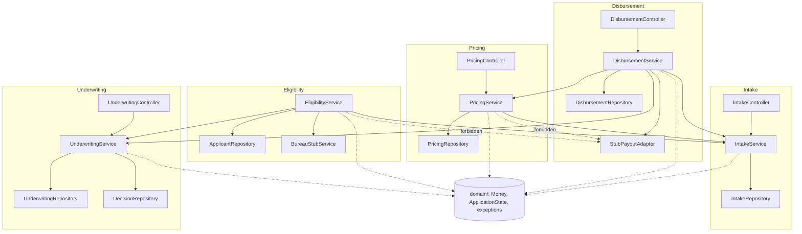

# LoanForge — Architecture

## Layered Structure
`Controller -> Service -> Repository -> MongoDB`. Domain types (`src/api/src/domain/`) are
framework-free (no NestJS decorators) and shared across every module — they are depended on, never
depend on a feature module themselves.

Each feature module owns its own `controller/`, `service/`, `repository/`, `schema/` (and `config/`
where relevant) sub-folders. `eligibility` and `pricing` have no public controller of their own where
that route naturally belongs to another module (`GET /applications/:id/offer` lives in `pricing`'s
controller since it's the offer's owner; eligibility is invoked only by service-to-service calls, never
over HTTP directly).

## Diagram

Eligibility and underwriting share the same underlying `applications` MongoDB collection through two
separate repositories (`IntakeRepository` for creation/reads, `UnderwritingRepository` for guarded state
transitions) — this is a deliberate choice (Application is the central aggregate every feature operates
on), not an accidental duplication. Cross-module reads/writes always go through the owning module's
**service** (e.g. eligibility calls `IntakeService.findById` and `UnderwritingService.transition`), never
another module's repository directly.

## Boundary Rules
1. **Controller -> Service -> Repository.** A repository never calls a service (no upward calls).
2. **The scoring/pricing and eligibility engines never call the disbursement adapter directly** (NFR-05)
   — only `underwriting`/`disbursement` orchestrate the `APPROVED -> DISBURSED` payout step.
3. **Domain has zero imports from any feature module.** `src/api/src/domain/` (`Money`,
   `ApplicationState`, exceptions) is depended on by every module but depends on none of them.
4. **Service-to-service, not repository-to-repository, across module boundaries.** When one module
   needs another module's data (e.g. disbursement needs the application and the offer), it calls that
   module's exported service, never reaches into its repository or schema directly (the one deliberate
   exception is reusing another module's *schema class* to register a second, read-only Mongoose model
   against the same collection — e.g. disbursement's `ApplicantAccountRepository` reads the `applicants`
   collection via eligibility's `Applicant` schema — this is a data-shape reuse, not a repository call).

## Enforcement
`.dependency-cruiser.cjs` (repo root) declares four forbidden-dependency rules, run via
`npm run test:arch --workspace=src/api`:
- `no-pricing-to-disbursement` / `no-eligibility-to-disbursement` — enforce rule 2 (NFR-05).
- `no-repository-to-service` — enforce rule 1.
- `no-domain-to-modules` — enforce rule 3.

This was spot-checked by temporarily adding a real (used, value-level) import from `pricing.service.ts`
to `disbursement`'s `StubPayoutAdapter` — the test failed with `error no-pricing-to-disbursement:
src/modules/pricing/service/pricing.service.ts → src/modules/disbursement/service/stub-payout.adapter.ts`,
confirming the rule actually fires, before the import was reverted.

**Gotcha found while wiring this up:** dependency-cruiser only registers an import as a dependency edge
if it survives to a genuine value-level reference — a type-only or entirely unused import gets elided
before its analysis and silently produces zero violations. When testing a dependency-cruiser rule
yourself, use a real (constructed/called) reference, not a bare `import` statement.
